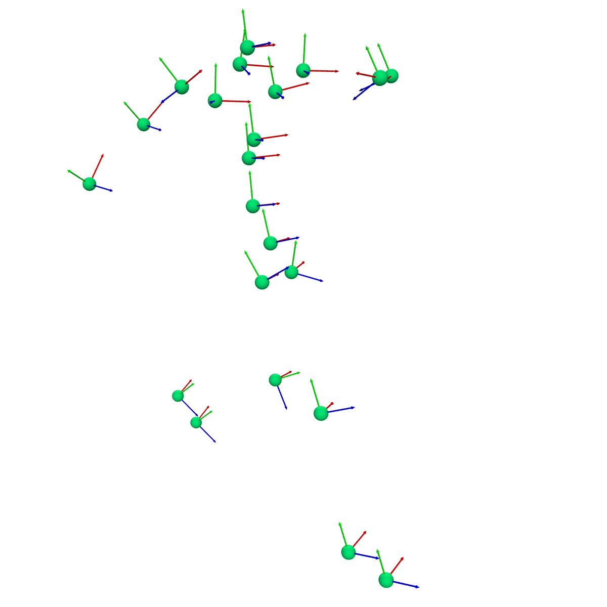

# Rigid Bodies

 

Rigid bodies are helpful to keep track of keypoint positions and orientations. 

## Example Usage:
Rigid bodies are used in the SMPL Sequence renderable [`smpl.py`](https://github.com/eth-ait/aitviewer/blob/main/aitviewer/renderables/smpl.py#L166), to display joint orientations (when mounted to each joint). They are initialized and added to the SMPL sequence as a child renderable. 


```python
# Create Rigid Bodies
# self.joints = (F, N, 3) Joint positions
# global_oris =  (F, N, 3, 3) Joint orientations as rotation matrices
self.rbs = RigidBodies(self.joints, global_oris, length=0.1, gui_affine=False, name="Joint Angles")

# Add rigid bodies to the current renderable as a child
# self._show_joint_angles = Boolean to show the joint angles or not when adding
self._add_node(self.rbs, enabled=self._show_joint_angles)
```
