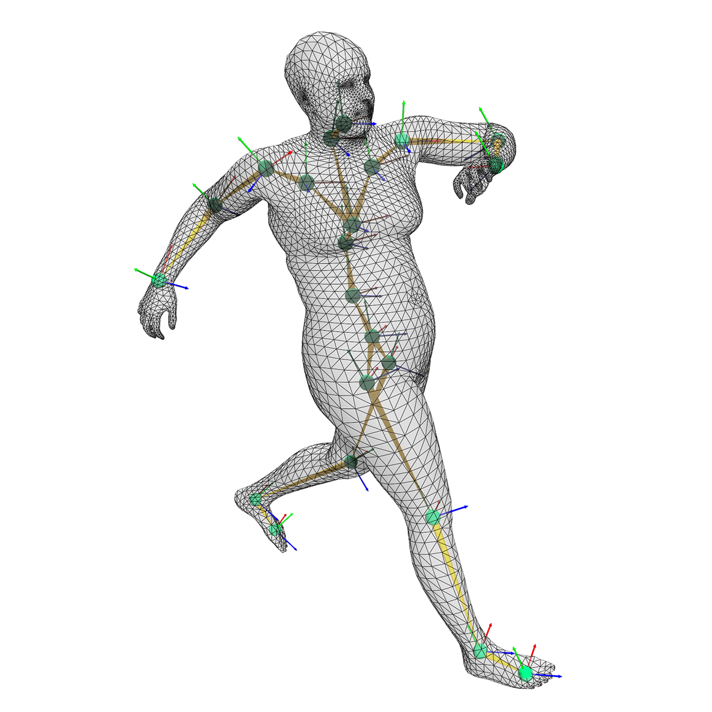

# SMPL/STAR Sequences
 

SMPL Sequences can be natively loaded and animated. We support loading from AMASS, and other datasets such as 3DPW. SMPL Sequences can also be manually initialized, and even edited via the GUI. The resulting mesh can be exported as an OBJ.

## Configuration
SMPL Sequences expect a proper [configuration](../configuration) of the SMPL family of body models.

## Create a T-posed SMPL body:
Example usage in the [`load_template.py`](https://github.com/eth-ait/aitviewer/blob/main/examples/load_template.py):

```python
from aitviewer.configuration import CONFIG as C
from aitviewer.models.smpl import SMPLLayer
from aitviewer.renderables.smpl import SMPLSequence

smplh_template = SMPLSequence.t_pose(SMPLLayer(model_type="smplh", gender="neutral", device=C.device), name="SMPL")

```


## Load from AMASS
Example usage in the [`load_AMASS.py`](https://github.com/eth-ait/aitviewer/blob/main/examples/load_AMASS.py):


```python
# Load an AMASS sequence and make sure it's sampled at 60 fps. This automatically loads the SMPL-H model.
# We set transparency to 0.5 and render the joint coordinates systems.
c = (149/255, 85/255, 149/255, 0.5)
seq_amass = SMPLSequence.from_amass(
    npz_data_path=os.path.join(C.datasets.amass, "ACCAD/Female1Running_c3d/C2 - Run to stand_poses.npz"),
    fps_out=60.0, color=c, name="AMASS Running", show_joint_angles=True)

# Instead of displaying the mesh, we can also just display point clouds.
#
# Point clouds do not actually draw triangulated spheres (like the `Spheres` class does). They
# use a more efficient shader, so that a large amount of points can be rendered (at the cost of not having a proper
# illumination model on the point clouds).
#
# Move the point cloud a bit along the x-axis so it doesn't overlap with the mesh data.
# Amass data need to be rotated to get the z axis up.
ptc_amass = PointClouds(points=seq_amass.vertices, position=np.array([1.0, 0.0, 0.0]), color=c, z_up=True)

# Display in the viewer.
v = Viewer()
v.run_animations = True
v.scene.camera.position = np.array([10.0, 2.5, 0.0])
v.scene.add(seq_amass, ptc_amass)
v.run()
```

